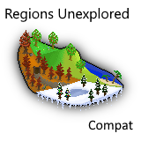

# Seasons Unexplored Fabric

A mod that adds compatibility between [Regions Unexplored](https://www.curseforge.com/minecraft/mc-mods/regions-unexplored) and [Fabric Seasons](https://www.curseforge.com/minecraft/mc-mods/fabric-seasons).

## Important Note
This is a fabric 1.20.1 mod!  
Do not use on 1.20.4 or newer!  
Do not use with Serene Seasons as that mod already works on itself with Regions Unexplored.

## Can I use this in a modpack?
Yes, just make sure to give proper credits and linking to the source of the download. 

## License
It's the MIT license, see the [LICENSE](./LICENSE) file